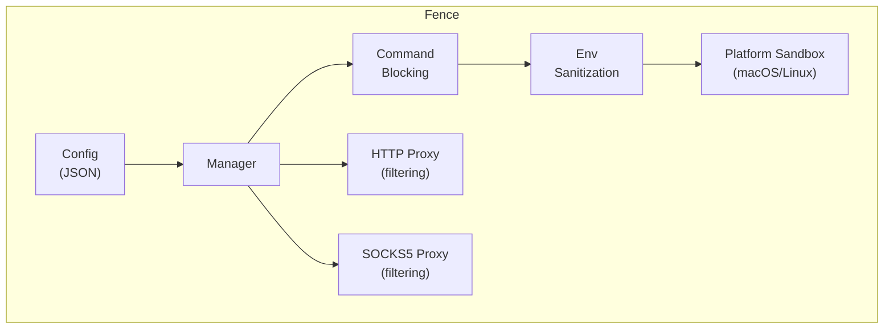
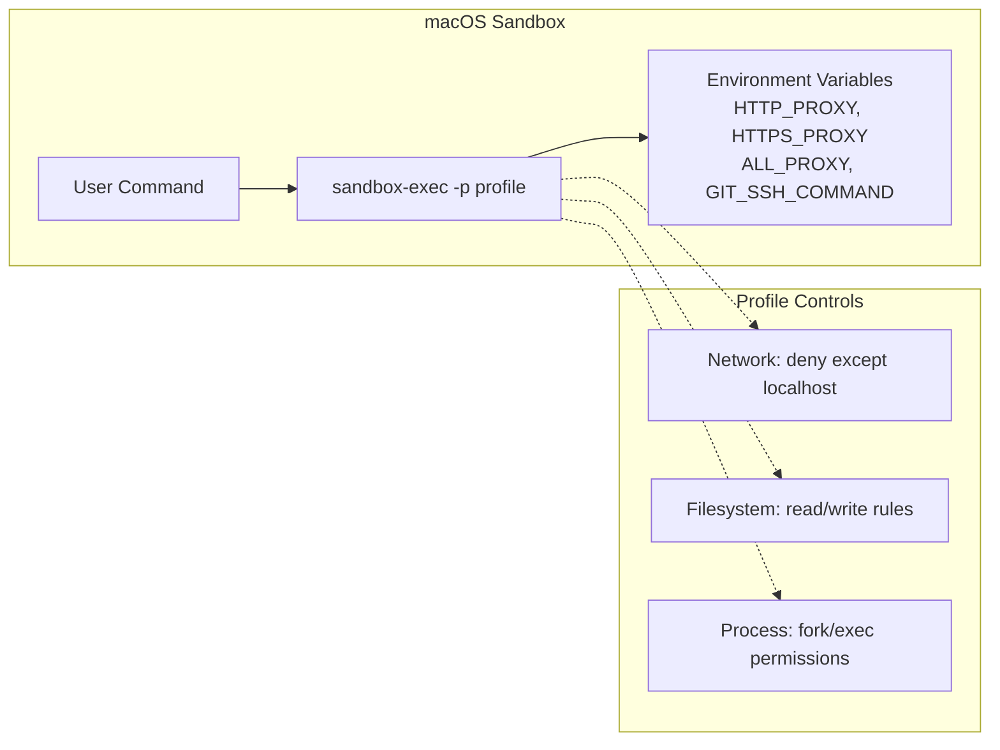
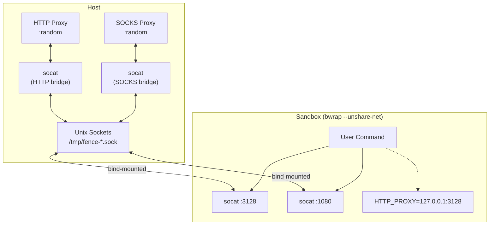
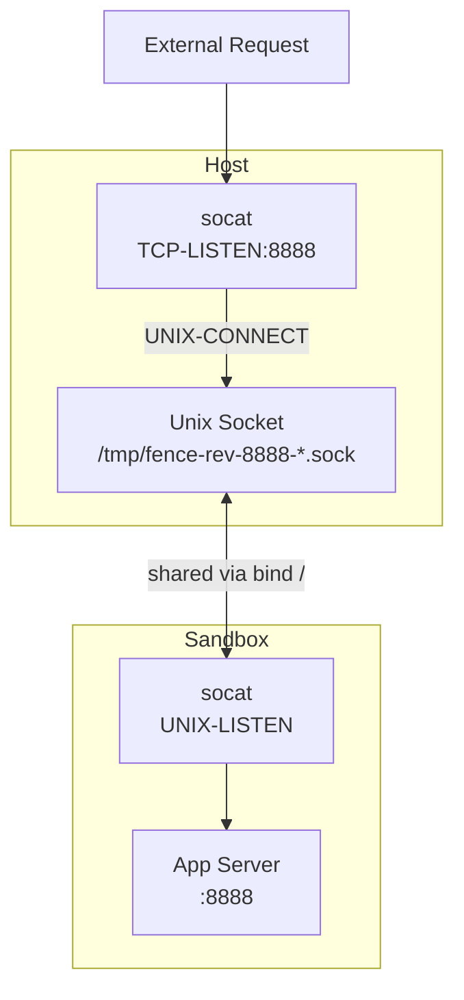
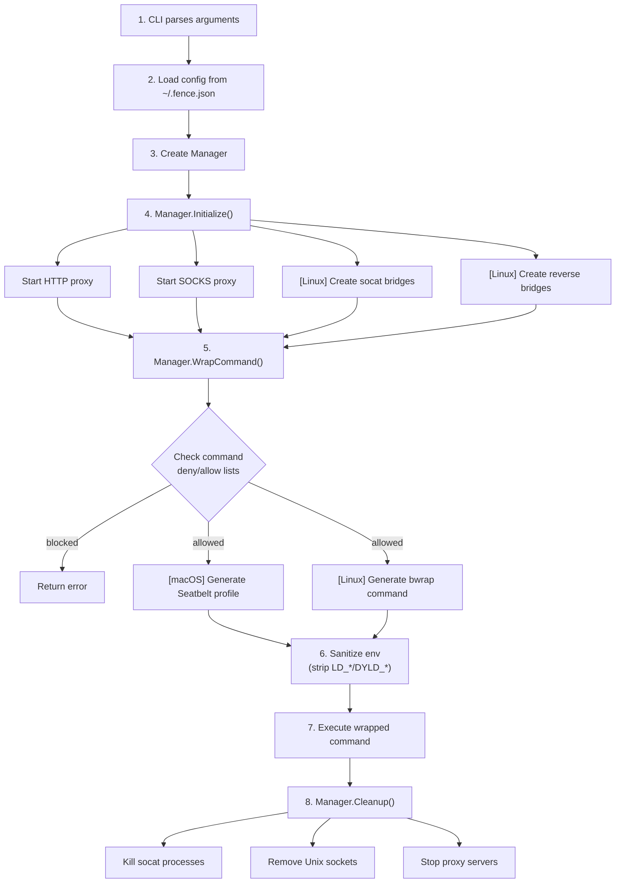

# Architecture

Fence restricts network, filesystem, and command access for arbitrary commands. It works by:

1. **Blocking commands** via configurable deny/allow lists before execution
2. **Intercepting network traffic** via HTTP/SOCKS5 proxies that filter by domain
3. **Sandboxing processes** using OS-native mechanisms (macOS sandbox-exec, Linux bubblewrap)
4. **Sanitizing environment** by stripping dangerous variables (LD_PRELOAD, DYLD_INSERT_LIBRARIES, etc.)



## Project Structure

```text
fence/
├── cmd/fence/           # CLI entry point
│   └── main.go          # Includes --landlock-apply wrapper mode
├── internal/            # Private implementation
│   ├── config/          # Configuration loading/validation
│   ├── platform/        # OS detection
│   ├── proxy/           # HTTP and SOCKS5 filtering proxies
│   └── sandbox/         # Platform-specific sandboxing
│       ├── manager.go   # Orchestrates sandbox lifecycle
│       ├── macos.go     # macOS sandbox-exec profiles
│       ├── linux.go     # Linux bubblewrap + socat bridges
│       ├── linux_seccomp.go    # Seccomp BPF syscall filtering
│       ├── linux_landlock.go   # Landlock filesystem control
│       ├── linux_ebpf.go       # eBPF violation monitoring
│       ├── linux_features.go   # Kernel feature detection
│       ├── linux_*_stub.go     # Non-Linux build stubs
│       ├── monitor.go   # macOS log stream violation monitoring
│       ├── command.go   # Command blocking/allow lists
│       ├── hardening.go # Environment sanitization
│       ├── dangerous.go # Protected file/directory lists
│       ├── shell.go     # Shell quoting utilities
│       └── utils.go     # Path normalization
└── pkg/fence/           # Public Go API
    └── fence.go
```

## Core Components

### Config (`internal/config/`)

Handles loading and validating sandbox configuration:

```go
type Config struct {
    Network    NetworkConfig    // Domain allow/deny lists
    Filesystem FilesystemConfig // Read/write restrictions
    Command    CommandConfig    // Command deny/allow lists
    AllowPty   bool             // Allow pseudo-terminal allocation
}
```

- Loads from `~/.fence.json` or custom path
- Falls back to restrictive defaults (block all network, default command deny list)
- Validates paths and normalizes them

### Platform (`internal/platform/`)

Simple OS detection:

```go
func Detect() Platform  // Returns MacOS, Linux, Windows, or Unknown
func IsSupported() bool // True for MacOS and Linux
```

### Proxy (`internal/proxy/`)

Two proxy servers that filter traffic by domain:

#### HTTP Proxy (`http.go`)

- Handles HTTP and HTTPS (via CONNECT tunneling)
- Extracts domain from Host header or CONNECT request
- Returns 403 for blocked domains
- Listens on random available port

#### SOCKS5 Proxy (`socks.go`)

- Uses `github.com/things-go/go-socks5`
- Handles TCP connections (git, ssh, etc.)
- Same domain filtering logic as HTTP proxy
- Listens on random available port

**Domain Matching:**

- Exact match: `example.com`
- Wildcard prefix: `*.example.com` (matches `api.example.com`)
- Deny takes precedence over allow

### Sandbox (`internal/sandbox/`)

#### Manager (`manager.go`)

Orchestrates the sandbox lifecycle:

1. Initializes HTTP and SOCKS proxies
2. Sets up platform-specific bridges (Linux)
3. Checks command against deny/allow lists
4. Wraps commands with sandbox restrictions
5. Handles cleanup on exit

#### Command Blocking (`command.go`)

Blocks commands before they run based on configurable policies:

- **Default deny list**: Dangerous system commands (`shutdown`, `reboot`, `mkfs`, `rm -rf`, etc.)
- **Custom deny/allow**: User-configured prefixes (e.g., `git push`, `npm publish`)
- **Chain detection**: Parses `&&`, `||`, `;`, `|` to catch blocked commands in pipelines
- **Nested shells**: Detects `bash -c "blocked_cmd"` patterns

#### Environment Sanitization (`hardening.go`)

Strips dangerous environment variables before command execution:

- Linux: `LD_PRELOAD`, `LD_LIBRARY_PATH`, `LD_AUDIT`, etc.
- macOS: `DYLD_INSERT_LIBRARIES`, `DYLD_LIBRARY_PATH`, etc.

This prevents library injection attacks where a sandboxed process writes a malicious `.so`/`.dylib` and uses `LD_PRELOAD`/`DYLD_INSERT_LIBRARIES` in a subsequent command.

#### macOS Implementation (`macos.go`)

Uses Apple's `sandbox-exec` with Seatbelt profiles:



Seatbelt profiles are generated dynamically based on config:

- `(deny default)` - deny all by default
- `(allow network-outbound (remote ip "localhost:*"))` - only allow proxy
- `(allow file-read* ...)` - selective file access
- `(allow process-fork)`, `(allow process-exec)` - allow running programs

#### Linux Implementation (`linux.go`)

Uses `bubblewrap` (bwrap) with network namespace isolation:



**Why socat bridges?**

With `--unshare-net`, the sandbox has its own isolated network namespace - it cannot reach the host's network at all. Unix sockets provide filesystem-based IPC that works across namespace boundaries:

1. Host creates Unix socket, connects to TCP proxy
2. Socket file is bind-mounted into sandbox
3. Sandbox's socat listens on localhost:3128, forwards to Unix socket
4. Traffic flows: `sandbox:3128 → Unix socket → host proxy → internet`

## Inbound Connections (Reverse Bridge)

For servers running inside the sandbox that need to accept connections:



Flow:

1. Host socat listens on TCP port (e.g., 8888)
2. Sandbox socat creates Unix socket, forwards to app
3. External request → Host:8888 → Unix socket → Sandbox socat → App:8888

## Execution Flow



## Platform Comparison

| Feature | macOS | Linux |
|---------|-------|-------|
| Sandbox mechanism | sandbox-exec (Seatbelt) | bubblewrap + Landlock + seccomp |
| Network isolation | Syscall filtering | Network namespace |
| Proxy routing | Environment variables | socat bridges + env vars |
| Filesystem control | Profile rules | Bind mounts + Landlock (5.13+) |
| Syscall filtering | Implicit (Seatbelt) | seccomp BPF |
| Inbound connections | Profile rules (`network-bind`) | Reverse socat bridges |
| Violation monitoring | log stream + proxy | eBPF + proxy |
| Env sanitization | Strips DYLD_* | Strips LD_* |
| Requirements | Built-in | bwrap, socat |

### Linux Security Layers

On Linux, fence uses multiple security layers with graceful fallback:

1. bubblewrap (core isolation via Linux namespaces)
2. seccomp (syscall filtering)
3. Landlock (filesystem access control)
4. eBPF monitoring (violation visibility)

> [!NOTE]
> Seccomp blocks syscalls silently (no logging). With `-m` and root/CAP_BPF, the eBPF monitor catches these failures by tracing syscall exits that return EPERM/EACCES.

See [Linux Security Features](./docs/linux-security-features.md) for details.

## Violation Monitoring

The `-m` (monitor) flag enables real-time visibility into blocked operations. These only apply to filesystem and network operations, not blocked commands.

### Output Prefixes

| Prefix | Source | Description |
|--------|--------|-------------|
| `[fence:http]` | Both | HTTP/HTTPS proxy (blocked requests only in monitor mode) |
| `[fence:socks]` | Both | SOCKS5 proxy (blocked requests only in monitor mode) |
| `[fence:logstream]` | macOS only | Kernel-level sandbox violations from `log stream` |
| `[fence:ebpf]` | Linux only | Filesystem/syscall failures (requires CAP_BPF or root) |
| `[fence:filter]` | Both | Domain filter rule matches (debug mode only) |

### macOS Log Stream

On macOS, fence spawns `log stream` with a predicate to capture sandbox violations:

```bash
log stream --predicate 'eventMessage ENDSWITH "_SBX"' --style compact
```

Violations include:

- `network-outbound` - blocked network connections
- `file-read*` - blocked file reads
- `file-write*` - blocked file writes

Filtered out (too noisy):

- `mach-lookup` - IPC service lookups
- `file-ioctl` - device control operations
- `/dev/tty*` writes - terminal output
- `mDNSResponder` - system DNS resolution
- `/private/var/run/syslog` - system logging

### Debug vs Monitor Mode

| Flag | Proxy logs | Filter rules | Log stream | Sandbox command |
|------|------------|--------------|------------|-----------------|
| `-m` | Blocked only | No | Yes (macOS) | No |
| `-d` | All | Yes | No | Yes |
| `-m -d` | All | Yes | Yes (macOS) | Yes |

## Security Model

See [`docs/security-model.md`](docs/security-model.md) for Fence's threat model, guarantees, and limitations.
