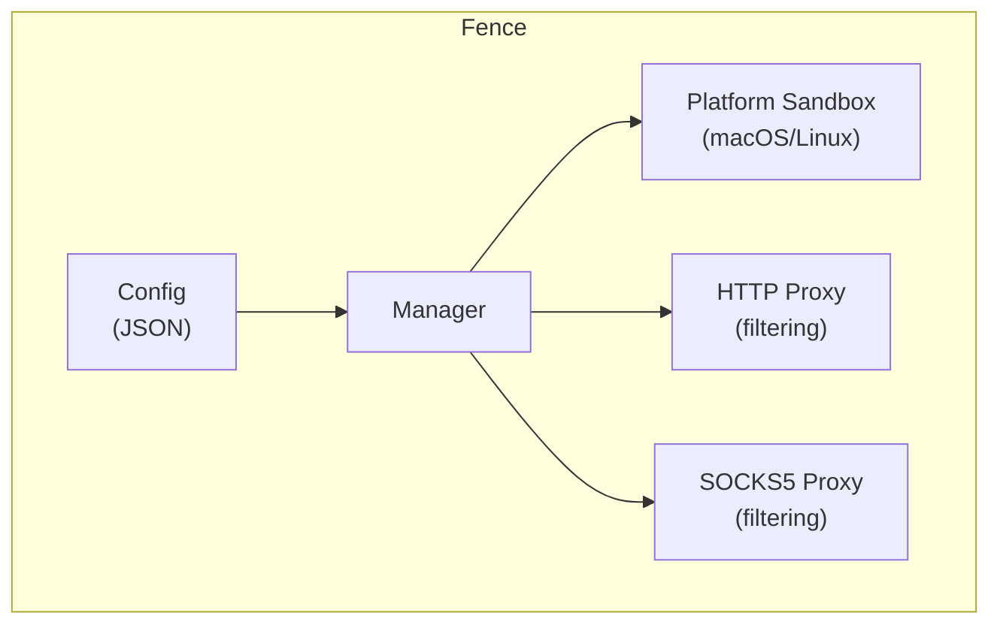
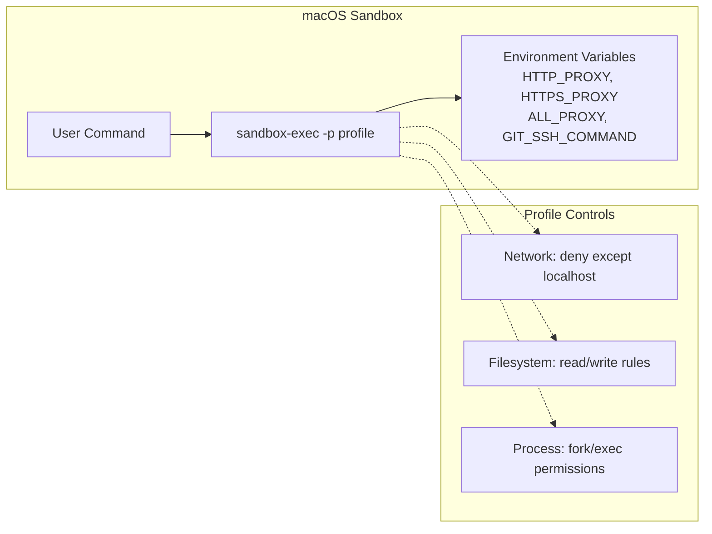
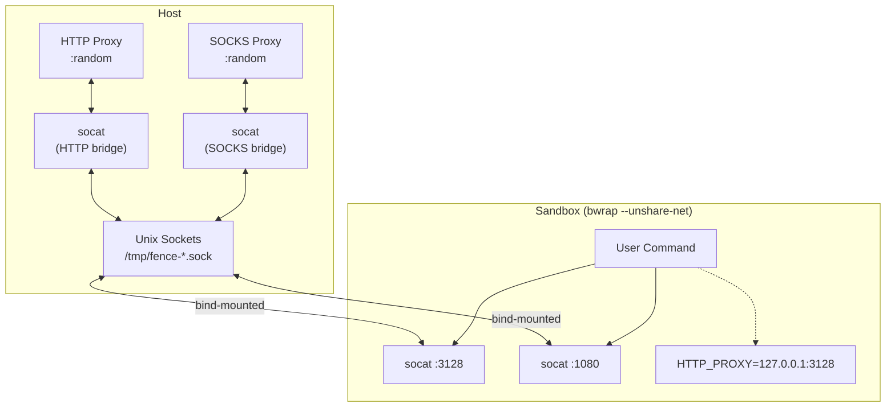
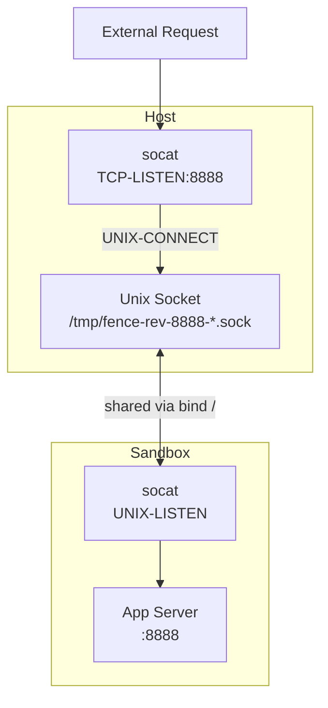
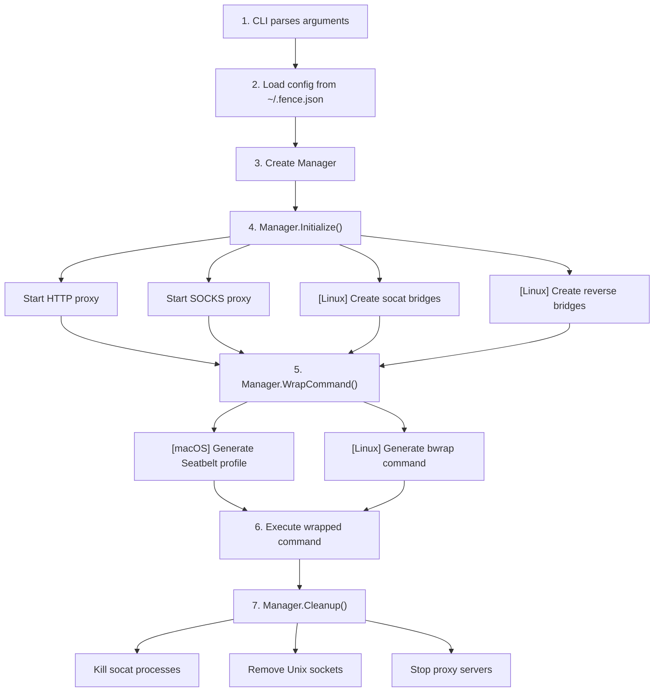

# Architecture

Fence restricts network and filesystem access for arbitrary commands. It works by:

1. **Intercepting network traffic** via HTTP/SOCKS5 proxies that filter by domain
2. **Sandboxing processes** using OS-native mechanisms (macOS sandbox-exec, Linux bubblewrap)
3. **Bridging connections** to allow controlled inbound/outbound traffic in isolated namespaces



## Project Structure

```text
fence/
├── cmd/fence/           # CLI entry point
│   └── main.go
├── internal/            # Private implementation
│   ├── config/          # Configuration loading/validation
│   ├── platform/        # OS detection
│   ├── proxy/           # HTTP and SOCKS5 filtering proxies
│   └── sandbox/         # Platform-specific sandboxing
│       ├── manager.go   # Orchestrates sandbox lifecycle
│       ├── macos.go     # macOS sandbox-exec profiles
│       ├── linux.go     # Linux bubblewrap + socat bridges
│       ├── monitor.go   # macOS log stream violation monitoring
│       ├── dangerous.go # Protected file/directory lists
│       └── utils.go     # Path normalization, shell quoting
└── pkg/fence/           # Public Go API
    └── fence.go
```

## Core Components

### Config (`internal/config/`)

Handles loading and validating sandbox configuration:

```go
type Config struct {
    Network    NetworkConfig    // Domain allow/deny lists
    Filesystem FilesystemConfig // Read/write restrictions
}
```

- Loads from `~/.fence.json` or custom path
- Falls back to restrictive defaults (block all network)
- Validates paths and normalizes them

### Platform (`internal/platform/`)

Simple OS detection:

```go
func Detect() Platform  // Returns MacOS, Linux, Windows, or Unknown
func IsSupported() bool // True for MacOS and Linux
```

### Proxy (`internal/proxy/`)

Two proxy servers that filter traffic by domain:

#### HTTP Proxy (`http.go`)

- Handles HTTP and HTTPS (via CONNECT tunneling)
- Extracts domain from Host header or CONNECT request
- Returns 403 for blocked domains
- Listens on random available port

#### SOCKS5 Proxy (`socks.go`)

- Uses `github.com/things-go/go-socks5`
- Handles TCP connections (git, ssh, etc.)
- Same domain filtering logic as HTTP proxy
- Listens on random available port

**Domain Matching:**

- Exact match: `example.com`
- Wildcard prefix: `*.example.com` (matches `api.example.com`)
- Deny takes precedence over allow

### Sandbox (`internal/sandbox/`)

#### Manager (`manager.go`)

Orchestrates the sandbox lifecycle:

1. Initializes HTTP and SOCKS proxies
2. Sets up platform-specific bridges (Linux)
3. Wraps commands with sandbox restrictions
4. Handles cleanup on exit

#### macOS Implementation (`macos.go`)

Uses Apple's `sandbox-exec` with Seatbelt profiles:



Seatbelt profiles are generated dynamically based on config:

- `(deny default)` - deny all by default
- `(allow network-outbound (remote ip "localhost:*"))` - only allow proxy
- `(allow file-read* ...)` - selective file access
- `(allow process-fork)`, `(allow process-exec)` - allow running programs

#### Linux Implementation (`linux.go`)

Uses `bubblewrap` (bwrap) with network namespace isolation:



**Why socat bridges?**

With `--unshare-net`, the sandbox has its own isolated network namespace - it cannot reach the host's network at all. Unix sockets provide filesystem-based IPC that works across namespace boundaries:

1. Host creates Unix socket, connects to TCP proxy
2. Socket file is bind-mounted into sandbox
3. Sandbox's socat listens on localhost:3128, forwards to Unix socket
4. Traffic flows: `sandbox:3128 → Unix socket → host proxy → internet`

## Inbound Connections (Reverse Bridge)

For servers running inside the sandbox that need to accept connections:



Flow:

1. Host socat listens on TCP port (e.g., 8888)
2. Sandbox socat creates Unix socket, forwards to app
3. External request → Host:8888 → Unix socket → Sandbox socat → App:8888

## Execution Flow



## Platform Comparison

| Feature | macOS | Linux |
|---------|-------|-------|
| Sandbox mechanism | sandbox-exec (Seatbelt) | bubblewrap (namespaces) |
| Network isolation | Syscall filtering | Network namespace |
| Proxy routing | Environment variables | socat bridges + env vars |
| Filesystem control | Profile rules | Bind mounts |
| Inbound connections | Profile rules (`network-bind`) | Reverse socat bridges |
| Violation monitoring | log stream + proxy | proxy only |
| Requirements | Built-in | bwrap, socat |

## Violation Monitoring

The `-m` (monitor) flag enables real-time visibility into blocked operations.

### Output Prefixes

| Prefix | Source | Description |
|--------|--------|-------------|
| `[fence:http]` | Both | HTTP/HTTPS proxy (blocked requests only in monitor mode) |
| `[fence:socks]` | Both | SOCKS5 proxy (blocked requests only in monitor mode) |
| `[fence:logstream]` | macOS only | Kernel-level sandbox violations from `log stream` |
| `[fence:filter]` | Both | Domain filter rule matches (debug mode only) |

### macOS Log Stream

On macOS, fence spawns `log stream` with a predicate to capture sandbox violations:

```bash
log stream --predicate 'eventMessage ENDSWITH "_SBX"' --style compact
```

Violations include:

- `network-outbound` - blocked network connections
- `file-read*` - blocked file reads
- `file-write*` - blocked file writes

Filtered out (too noisy):

- `mach-lookup` - IPC service lookups
- `file-ioctl` - device control operations
- `/dev/tty*` writes - terminal output
- `mDNSResponder` - system DNS resolution
- `/private/var/run/syslog` - system logging

### Linux Limitations

Linux uses network namespace isolation (`--unshare-net`), which prevents connections at the namespace level rather than logging them. There's no kernel-level violation stream equivalent to macOS.

With `-m` on Linux, you only see proxy-level denials:

```text
[fence:http] 14:30:01 ✗ CONNECT 403 evil.com (blocked by proxy)
[fence:socks] 14:30:02 ✗ CONNECT evil.com:22 BLOCKED
```

### Debug vs Monitor Mode

| Flag | Proxy logs | Filter rules | Log stream | Sandbox command |
|------|------------|--------------|------------|-----------------|
| `-m` | Blocked only | No | Yes (macOS) | No |
| `-d` | All | Yes | No | Yes |
| `-m -d` | All | Yes | Yes (macOS) | Yes |

## Security Model

### How Each Layer Works

#### Network Isolation

All outbound connections are routed through local HTTP/SOCKS5 proxies that filter by domain:

- Direct socket connections are blocked at the OS level (syscall filtering on macOS, network namespace on Linux)
- Only localhost connections to the proxy ports are allowed
- The proxy inspects the target domain and allows/denies based on config
- Environment variables (`HTTP_PROXY`, `HTTPS_PROXY`, `ALL_PROXY`) route application traffic

#### Filesystem Restrictions

Access control follows a deny-by-default model for writes:

| Operation | Default | Config |
|-----------|---------|--------|
| Read | Allow all | `denyRead` blocks specific paths |
| Write | Deny all | `allowWrite` permits specific paths |
| Write exceptions | - | `denyWrite` overrides `allowWrite` |

#### Dangerous File Protection

Certain paths are always protected from writes regardless of config to prevent common attack vectors:

- Shell configs: `.bashrc`, `.zshrc`, `.profile`, `.bash_profile`
- Git hooks: `.git/hooks/*` (can execute arbitrary code on git operations)
- Git config: `.gitconfig`, `.git/config` (can define aliases that run code)
- SSH config: `.ssh/config`, `.ssh/authorized_keys`
- Editor configs that can execute code: `.vimrc`, `.emacs`

#### Process Isolation

- Commands run in isolated namespaces (Linux) or with syscall restrictions (macOS)
- PID namespace isolation prevents seeing/signaling host processes (Linux)
- New session prevents terminal control attacks

### What Fence Blocks

| Attack Vector | How It's Blocked |
|---------------|------------------|
| Arbitrary network access | Proxy filtering + OS-level enforcement |
| Data exfiltration to unknown hosts | Only allowlisted domains reachable |
| Writing malicious git hooks | `.git/hooks` always protected |
| Modifying shell startup files | `.bashrc`, `.zshrc`, etc. always protected |
| Reading sensitive paths | Configurable via `denyRead` |
| Arbitrary filesystem writes | Only `allowWrite` paths permitted |

### What Fence Allows

- Network access to explicitly allowed domains
- Filesystem reads (except `denyRead` paths)
- Filesystem writes to `allowWrite` paths
- Process spawning within the sandbox
- Inbound connections on exposed ports (`-p` flag)

### Limitations

#### Domain-based filtering only

Fence doesn't inspect request content. A sandboxed process can:

- Download arbitrary code from allowed domains
- Exfiltrate data by encoding it in requests to allowed domains
- Use allowed domains as tunnels if they support it

You're trusting your allowlist - if you allow `*.github.com`, the sandbox can reach any GitHub-hosted content.

#### Root processes may escape restrictions

- *Linux*: The sandboxed process has root inside its namespace and could potentially manipulate mounts, cgroups, or exploit kernel vulnerabilities. Network namespace isolation (`--unshare-net`) is solid, but filesystem isolation via bind mounts is more permeable.
- *macOS*: `sandbox-exec` is robust at the kernel level, but root can modify system state before the sandbox starts or (on older macOS) load kernel extensions.

#### macOS sandbox-exec is deprecated

Apple deprecated `sandbox-exec` but it still works on current macOS (including Sequoia). There's no good alternative for CLI sandboxing:

- App Sandbox requires signed `.app` bundles
- Virtualization.framework is heavyweight
- We use `sandbox-exec` pragmatically until Apple removes it

#### Not for hostile code containment

Fence is defense-in-depth for running semi-trusted code (npm install, build scripts, CI jobs), not a security boundary against actively malicious software designed to escape sandboxes.
